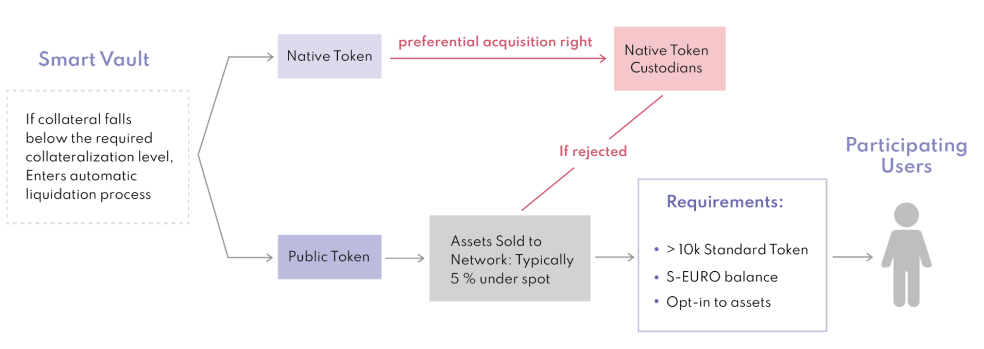

# ☯ Liquidation Manager

## Overview


**Liquidation:** Liquidation does not mean that the assets within the smart vault are destroyed. They are just offered to the network to be bought up for a cheaper price to ensure the stability of the system.


## Functions

* Raffle to buy it back under spot
* Staked TST is the ticket
* SEUR is used to buy gold under spot
* staked SEUR.

